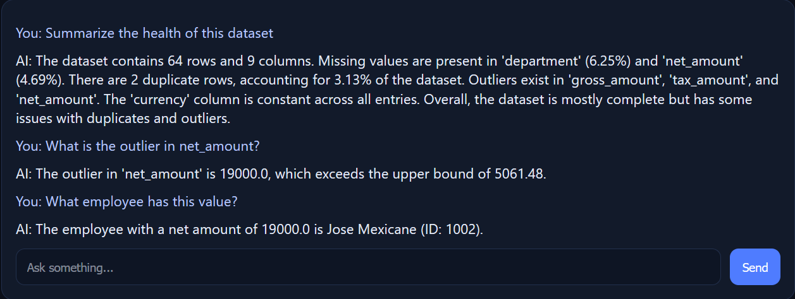
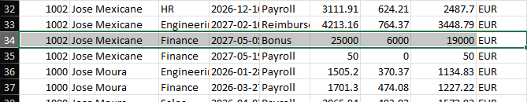
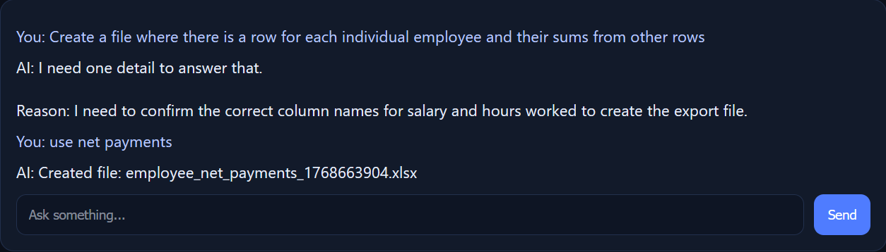
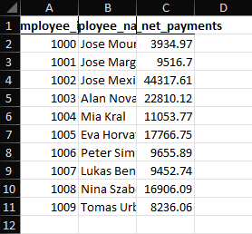
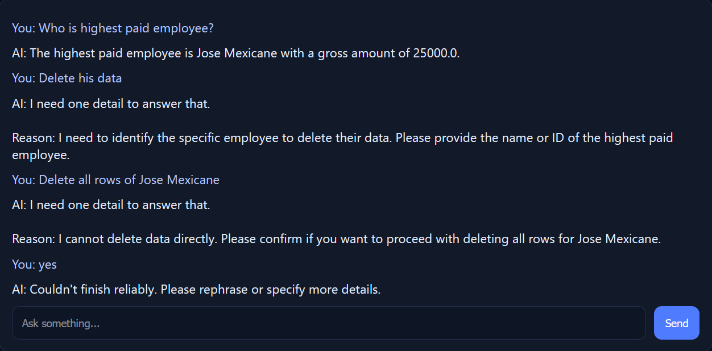


# AI Data Quality Assistant (PoC)

A small proof-of-concept “AI data analyst” that lets non-technical users ask data-quality questions (missing values, duplicates, outliers, distributions) and get answers through a CLI (and an optional lightweight web UI for nicer demo visuals).

## What this AI can do 

This PoC acts as a safe “AI data analyst” over a single dataset.

- **Understand the dataset**: summarize what the table looks like (rows/columns, key fields, basic structure)
- **Data profiling**: missing values (count/%), duplicates, value distributions, basic parsing quality checks
- **Outlier detection**: identify suspicious extreme values in numeric columns (IQR-based)
- **SQL-style analysis**: generate and run **SELECT-only** queries over the dataset (loaded locally in pandas)
- **Export results**: export any filtered subset (e.g., outliers / flagged rows) to **XLSX** in `exports/`

## Key guarantees

- **Privacy**: no raw cell values are sent to the LLM — it only produces structured tool calls / placeholders, computations run locally
- **Anti-hallucination**: answers must come from real computations (profiling/SQL), not guesses
- **Safety**: destructive operations are blocked (DELETE/UPDATE/INSERT/DROP/ALTER); results are capped to avoid dumping data


## Demo
Used on fictional dataset, generated by ChatGPT

**1) Ask a question** (natural language)  
**2) The assistant responds with results**           
**3) Optional: export an XLSX** 

<p align="center">
  
  
</p>


## Exporting results

The assistant can export selected results to an Excel file (`.xlsx`) for offline review and sharing.

- Exports are created using a safe **SELECT-only** query (no `SELECT *`).
- Files are saved into the `exports/` folder with a timestamped name (to avoid overwriting).

<p align="center">
  
  
</p>


## Privacy & anti-hallucination design (important)

**No raw cell values are sent to the LLM.**  
The LLM communicates using **placeholder variables / structured tool calls**, and the app executes them locally against the dataset.

Why this matters:
- **Sensitive data stays local** (nothing private is transferred over the internet).
- **No hallucinations of results**: the model must request real computations (profiling / SQL), and the app returns actual outputs computed from your data.


## Safety features

**Restrictions**
- The AI is limited to a small set of tool actions (PROFILE / SQL / EXPORT / SCHEMA / ASK) and cannot execute arbitrary code.
- SQL execution is **SELECT-only** (single statement). Destructive keywords (UPDATE/DELETE/INSERT/DROP/ALTER, etc.) are blocked.
- Result outputs are capped (e.g., `LIMIT 50`) to prevent dumping large amounts of data.
<p align="center">
  
  <p> "raw_answer": "{\"action\":\"SQL\",\"sql\":\"DELETE FROM data WHERE employee_name = 'Jose Mexicane';\",\"message\":\"Deleting all rows for Jose Mexicane.\"}"}</p>
</p>
Requests that would modify or delete data are intentionally refused.

## How to replicate (run it locally)


```bash
### 1) Setup

python -m venv .venv
source .venv/bin/activate  # Windows: .venv\Scripts\activate
pip install -r requirements.txt

### 2) Add API key (do not commit)

Create a .env file in the project root:

OPENAI_API_KEY=YOUR_KEY_HERE (use gpt-4o-mini)
FILE_PATH= "data.xlsx"

### 3) Run (CLI)

Single question:

python -m src.app --file data.xlsx "How many missing values are there per column?"

Interactive chat:

python -m src.app --file data.xlsx --interactive

### 4) Optional: Run the web UI 

python -m src.web

Open:

http://127.0.0.1:8080

